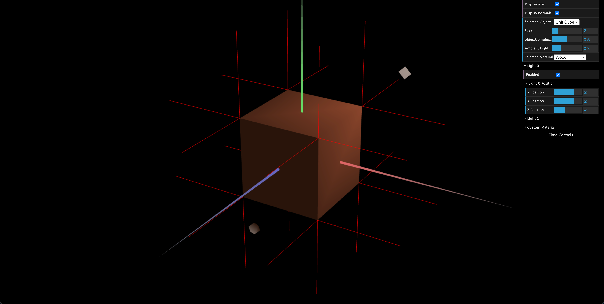
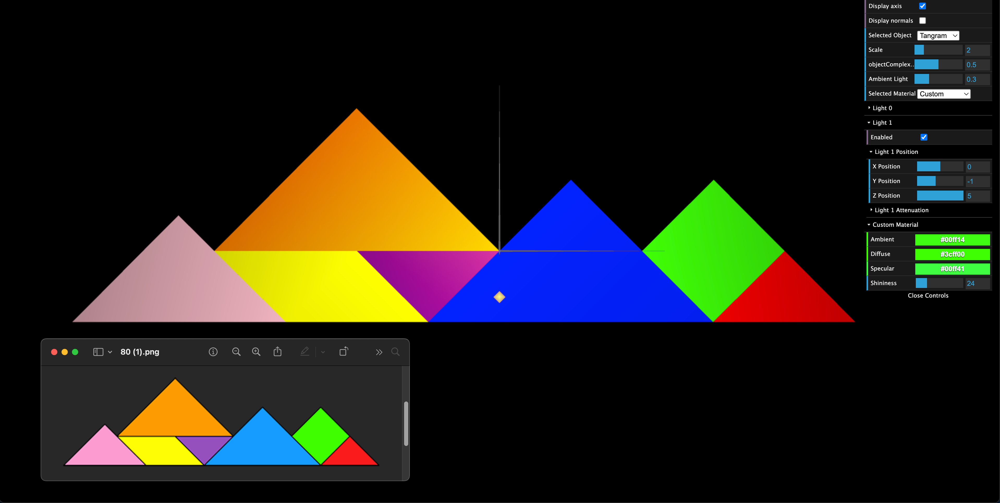
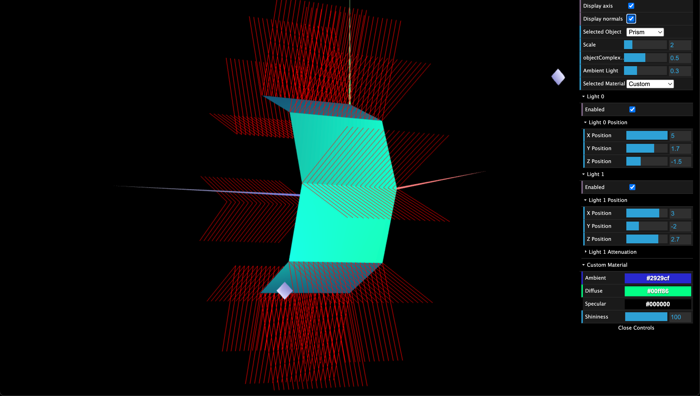
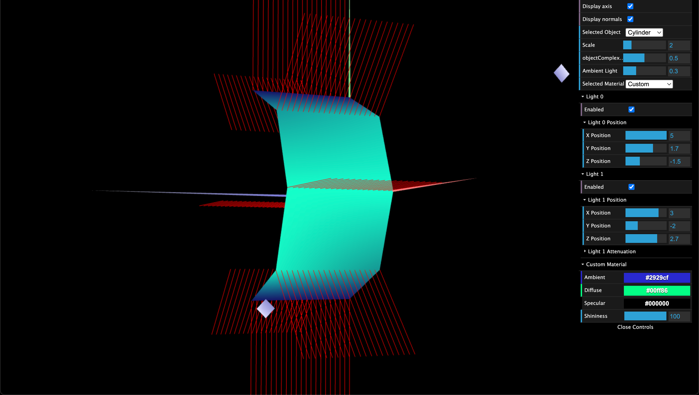

# CG 2024/2025

## Group T07G02

## TP 3 Notes
- In the part 1 of the exercise, the correct normals were set for the cube and tangram to reflect light accurately and naturally. 
- A wood material was also created, as shown in the figure 1.

Figure 1 - Wood cube  

- Each tangram piece was assigned a material with the correct color and high specular, as shown in Figure 2. The MyDiamond piece (green) uses a custom material adjustable via the interface.

Figure 2 - MyTangram colored  

- In part 2 of the exercise, we implemented a dynamic prism that adjusts based on the number of slices and stacks, as shown in Figure 3 (8 slices and 20 stacks).
- With the definition of normals in this exercise, the calculated lighting can be similar to "Constant Shading" because the normals don't vary smoothly across the surface, leading to a uniform lighting effect that lacks the nuances of more advanced shading techniques.

Figure 3 - Dynamic stack and slice Prism  

- In part 3 of the exercise, we adjusted the normals of the prism to make the lighting transitions smoother, reducing the visibility of the edges and giving it an appearance closer to a cylinder, as shown in Figure 4.

Figure 4 - Dynamic stack and slice approximate Cylinder  

